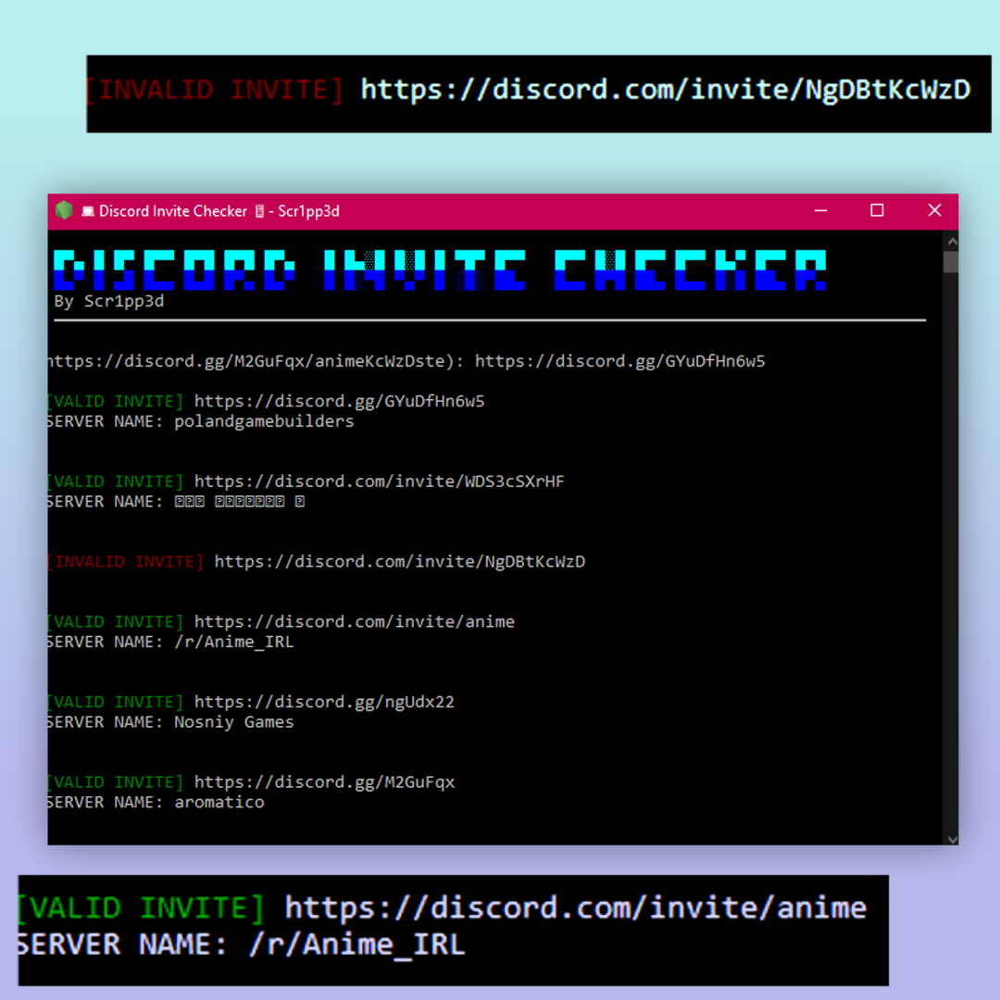

# Discord-Invite-Checker
Made by Scr1pp3d - This checks invites and tells you which ones are valid and which ones aren't.

# About
This was made by Scr1pp3d with the following:
      - colors (to change the text colour)
      - dialog (for dialog box (doesn't work))
      - node-bash-title (to change the name of the console)
      - pkg (to package the file into an .exe file)
      - prompt-sync (do ask the user a question (asking for the links)
      - puppeteer (for web scraping and checking if the invite is valid)

# Installation

1. Go on <a href="https://github.com/Scripped/Discord-Invite-Checker/tags">releases</a> and download the most recent one.
2. Extract the .zip file.
3. Click on the app for your device.
      (windows = app-win)
      (mac = app-macos)
      (linux = app-linux)
4. It should hopefully start working.
5. Any issues, contact me on here or on roblox:
        - username: scr1pp3d
        - link: https://www.roblox.com/users/1957038621/profile

# Usage

1. Click on the app for your device.
      (windows = app-win)
      (mac = app-macos)
      (linux = app-linux)
2. Paste the links (REMEMBER - RIGHT CLICK TO PASTE, CTRL+V WON'T WORK AND CTRL+C WILL CLOSE THE PROGRAM)
        - NOTE: Don't worry if the link looks weird, it's most likely fine.
3. Wait for the results if this takes longer than 3 minutes, it might not work at all (unless you just have really bad WIFI)

# Contact

- roblox: https://www.roblox.com/users/1957038621/profile (username: scr1pp3d)
- github: https://github.com/Scripped
